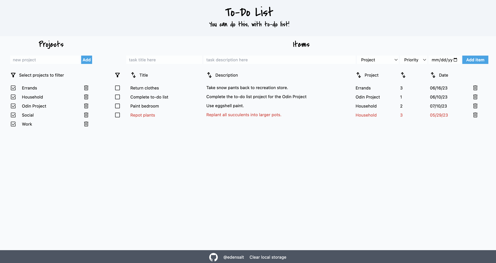
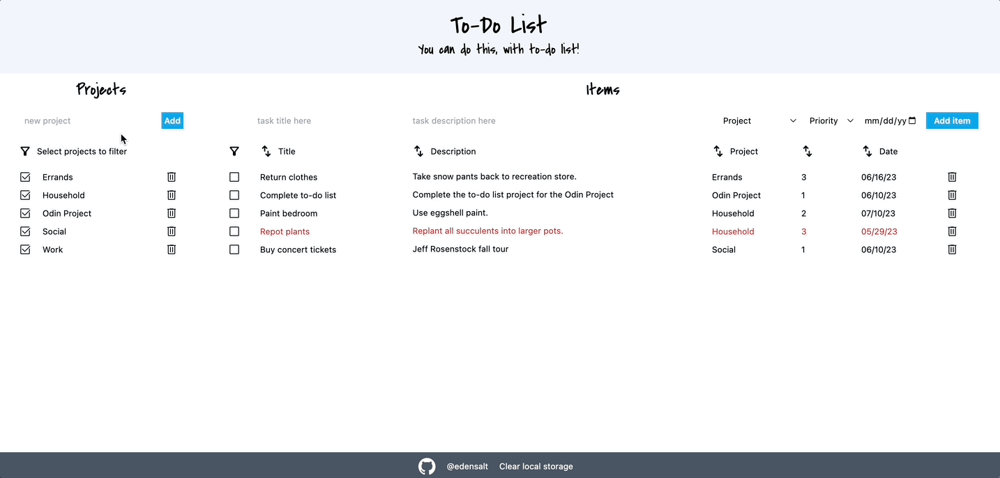
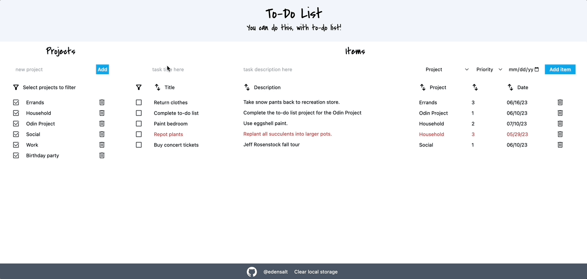
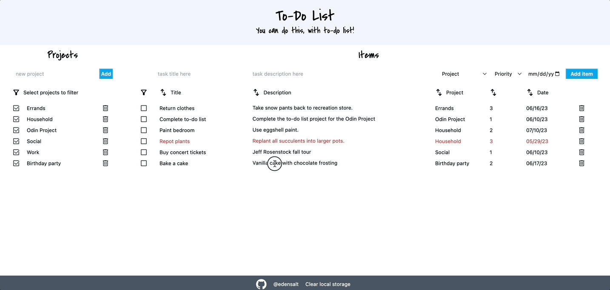
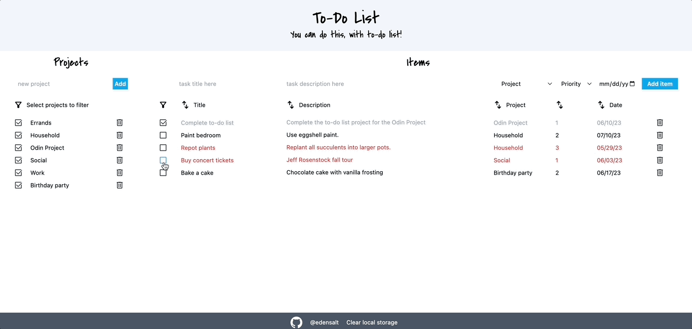
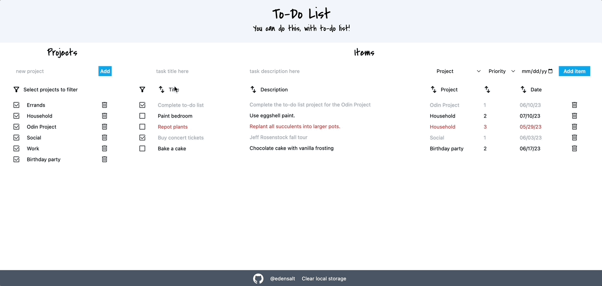
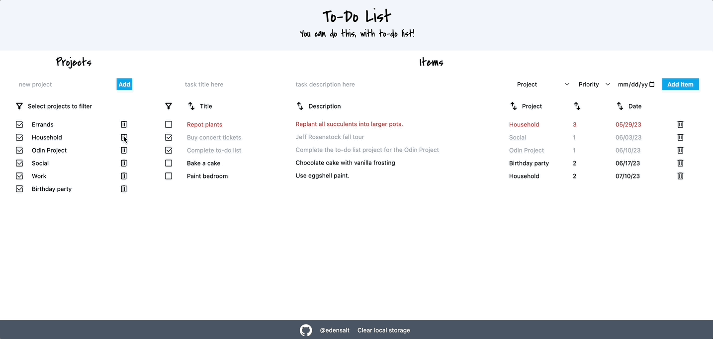
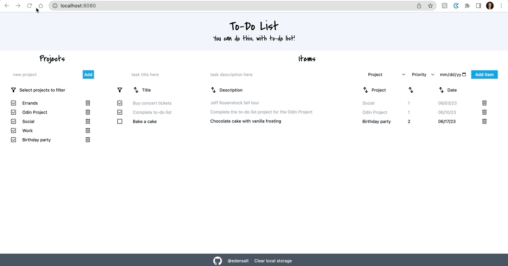
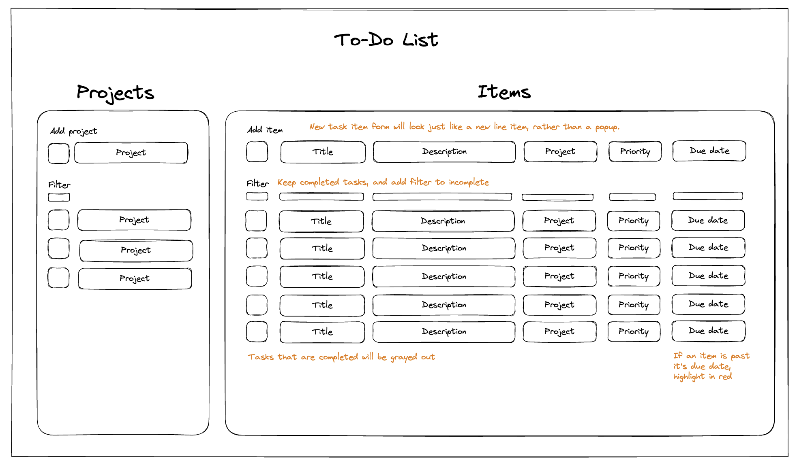

# to-do list

To-do list for the <a href="https://www.theodinproject.com/lessons/node-path-javascript-todo-list">Odin Project: JavaScript course</a>

## Skills demonstrated

The goal of this project was to build a program organized by JS modules while following SOLID programming principles. I used the following skills and tools:

- JS ES6 Modules, imports and exports
- JS factory functions
- If statements, object mapping
- DOM manipulation (filters and sorts)
- JS forms
- Tailwind CSS, grid, flex, responsive design
- Saving data to local storage
- Webpack, JSON and NPM
- date-fns for date formatting

## Product features

- Create new projects and tasks

- Edit, complete, and delete tasks

- Filter tasks by completion status or project

- Sort tasks by any component

- Delete entire projects and their tasks, with warning

- Date automatically saves to local storage, and is able to be deleted

- Responsive design for smaller screens (less ideal for 600-1000px wide; not ideal for <600px wide)

## Product design

The goal of this product design was simplicity with intuitive features that require little to no text instruction.

